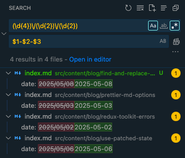

I sometimes need to search and replace across some code, but with parts of the search left untouched. Every time, I forget how to do it in VS Code.

The answer: `$n`.

For example, to convert every date from `YYYY/MM/DD` to `YYYY-MM-DD`:

```plain {2,7}
search (with Regex activated):
  (\d{4})\/(\d{2})\/(\d{2})
  translation: (4 digits)/(2 digits)/(2 digits)
                ↳group 1   ↳group 2   ↳group 3

replace:
  $1-$2-$3
```

Here's how that looks in VS Code:


